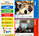

# 職務経歴書
## 基本情報

|key|value|
|---|-----|
|Name|ロンーグエンーティエン(Long Nguyen Tien)|
|メール|[Long Nguyen](long-nguyen@activeuser.co)|
|職務経歴書|[ダウンロード](./files/Long_Nguyen_職務経歴書.xlsx)|

### 自己紹介
大学卒業してから（2010)Androidアプリを開発始めました。日本に3.5年間ぐらいシステムエンジニアとして、モバイルアプリやゲームなどを作成しました。Java & Objective-Cは中心技術です。
自分の国を貢献できる希望で、ベトナムへ帰ってスタートアップ企業を設定、日本企業向けにインタネットサービス＆ゲームを展開しました。  
現在、管理能力を高める為に、ベトナム企業にチームリーダとして勤めています。
### 最終学歴
|卒業年月|学校名|専攻学科|
|----|-----|-----|
|2011年06月|ハノイ工科大学|ソフトウェアエンジニア|

## スキル
### 技術経験
|言語|プラットフォーム|OS|Database|
|----|-----|-----|-----|
|Java|Android|AWS|MySQL|
|Objective-C/Swift|iOS|Ubuntu|Sqlite|
|C#|Xamarin|CentOS|NoSQL|
|PHP|Unity|Google Cloud platform|
|Python|Yii 1.1|

### その他
- プロジェクトマネジメント経験：２年  
  - プロジェクト進捗管理（WaterfallまたはKanbanメソッド）  
  - チームサイズ： 20名
- オフショア開発のブリッジSE：4年
  - 言語だけでなく文化の違いを意識した開発ができます
- 会社を設立した経験があります（スタートアップ会社）
  - アウトソーシングサービス（ウエブ、アプリ開発）
  - インタネットサービス展開
  - 教育：開発・設計・デザイン
- デザイン
  - モバイルアプリデザイン経験があります
- インフラ
  - AWSへサーバ設定・管理する経験があります

## 資格
- IBM Certified Database Associate -- DB2 9 Fundamentals
- IBM Certified Solution Designer - Object Oriented Analysis and Design, vUML 2
- JSST(Japanese Standard Speaking Test) Level 7/10
- TOEIC 835/990

## 職務経歴
|期間||職場|役割|
|----|----|-----|-----|
|2017.5 ～ 現在  (正社員) ||[株式会社オルトプラスベトナム](https://altplus.com.vn/)   事業内容：アウトソーシングサービス(iOS/Android/Laravel/Game)|・プロジェクト管理 ・チームリーダー|
|2015.07   (スタートアップ) ||[個人のスタートアップ会社を設立しました。](https://activeuser.co/)    ベトナム向けのサービスを作り、またアウトソーシング（日本向け）の仕事をしていました。|Founder|
|2014.04 ～2015.07  (正社員) ||[楽天株式会社](https://corp.rakuten.co.jp/)   事業内容：E-Commerce, 銀行...|・iOS開発 ・システムエンジニア|
|2011.10 ～2014.04  (正社員) ||[株式会社カヤック](http://kayac.com)   事業内容：ソーシャルゲーム、esports事業、ウェブ＆アプリ開発|・Android開発 ・ゲーム開発|

## プロジェクト
|期間|画像|プロジェクト名|OS/言語|役割|
|----|-----|-----|-----|-----|
|2018/07||peep(ピープ) - ホラー・恋愛やスリラーのノベルをチャット小説で！毎日更新の携帯小説アプリ ・[Android アプリ](https://play.google.com/store/apps/details?id=jp.peep.app&hl=ja)|Android (Kotlin)|PM|
|2018/03||アニメビーンズ: 人気アニメが待つと観られる  ・[Android アプリ](https://play.google.com/store/apps/details?id=com.animebeans.app)  ・[iOS アプリ](https://itunes.apple.com/us/app/id1368870948)|Android(Kotlin), iOS(Swift), AWS(PHP)|PM|
|2017/09||日本介護システム ・医者はタブレットで患者を管理 ・介護士はモバイルアプリで患者の健康をチェック ・【参照】セキュリティーの為にリンク無しです|GCP(Python, Javascript)|PM|
|2017/04||[MESH: IOTデバイス管理システム](http://meshprj.com/en/)|AWS(Ruby on Rails)|PM|
|2016/08||天気ウィジェット - 番独特なウィジェットとの天気予報  ・TOP 15 アメリカ天気アプリ(2019年04） ・レート： 4.8★(753)（アメリカストア） [iOS アプリ](https://itunes.apple.com/app/apple-store/id1137060820?mt=8) |iOS(objectiveC), PHP|開発者|
|2017/01||iCountdown: イベントプランナー  ユニークで面白いカウントダウンウィゼット ・レート：4.6★, 145（アメリカストア） [iOS アプリ](https://itunes.apple.com/us/app/icountdown-countdown-planner/id1189515875)|iOS(objectiveC), PHP|開発者|
|2018/12||Goal Hunter - Goal setting app ゲーミフィケーション方法でゴール（目的）を簡単で達成できる ・レート： 5.0★, 10 （アメリカストア） [iOS アプリ](https://itunes.apple.com/us/app/goal-hunter-goal-setting-app/id1417258775?ls=1&mt=8) [Android アプリ](http://play.google.com/store/apps/details?id=co.au.goalhero)|Unity|開発者|
|2017/03||Creative Color - 100+ relaxing coloring books 大人のための塗り絵ゲーム  　・レート： 4.0★, 9 （アメリカストア） [iOS アプリ]()|Objective-C|開発者|
|2016/01||[日本の国際観光施設協会のサイト](http://www.kankou-fa.jp/)|Html,CSS,JS|BrSE|
|2015/10||[Enny TOEIC：TOEIC試験向け学習システム](https://ennytoeic.com) ユーザは簡単でアプリ（IOS/Android)又はWebsiteでTOEICを練習できるシステム [iOSアプリ](https://itunes.apple.com/vn/app/enny-toeic-practice/id932711660?l=vi&mt=8) [Android アプリ](https://play.google.com/store/apps/details?id=com.beanstack.enny&hl=en)|Android, iOS, AngularJS|PM|
|2014/04||[スマートペイシステム](https://smartpay.rakuten.co.jp/) （現金やクレジットカードを出さずにスマホだけで決済できるシステム）|Android, iOS, Java|開発者|
|2014/03||[Canary](https://www.kayac.com/service/other/1146)|Android|開発者|
|2013/12||[ポケット酪農２～大蝦夷農業高校銀匙購買部～](https://www.kayac.com/service/game/1127)|Unity|開発者|
|2013/09||[子どもまちづくりポケット](https://www.kayac.com/service/client/1117)|Android|開発者|
|2013/06||[ポケたび | JTB旅の便利スマートフォンアプリ](https://play.google.com/store/apps/details?id=jp.jtbtravel.voyage)|Android|開発者|
|2012/08||[Enjoy! Panasonic Smart App](https://www.kayac.com/service/client/1006)|Android|開発者|
